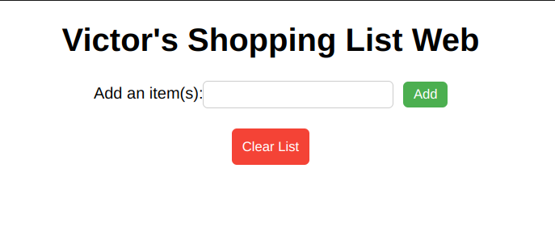
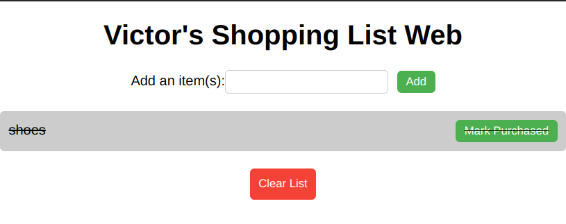

# Shopping List Web 

A simple web application for managing personal shopping lists.

## Table of Contents

- [Features](#features)
- [Installation](#installation)
- [Usage](#usage)
- [Prerequisites](#prerequisites)

## Features

- Add items to the shopping lists

- Mark items as purchased\

- Clear the entire shopping list  by clicking the Clear List button shown in the above image.

## Prerequisites
Make sure to have a modern web browser(E.g Chrome, Firefox, Edge)

## Installation
- Open Github and go to the repository phase-1-challenge2
- Click the 'Fork' button 
- Click the 'code' button 
- Click the SSH key 
- Open the terminal on your computer and type _"git clone[link here]"_ E.g:
      
       git clone git@github.com:VictorIgati/phase-1-challenge2.git
- Open vs code on the correct directory and it should function

## Usage
1. Enter an item in the input field and click the "Add" button to add it to the shopping list.
2. Click an item in the list to mark it as purchased (indicated by a strikethrough).
3. Click the "Clear List" button to remove all items from the shopping list.

**TO GAIN ACCESS TO THE WEBSITE**
**CLICK HERE**
              https://victorigati.github.io/phase-1-challenge2/